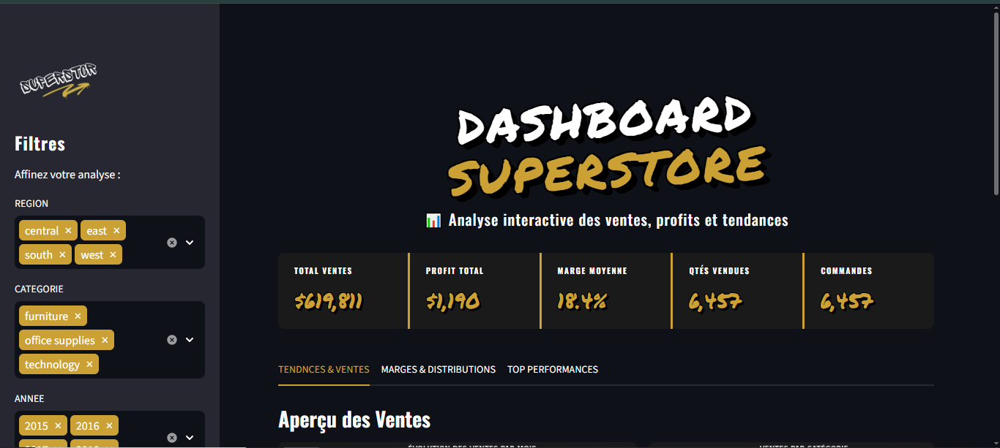
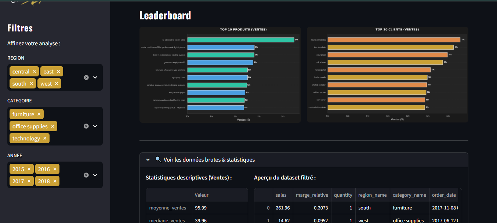

# 📊 Dashboard Performance Superstore

> **Une application interactive d'analyse de données de ventes et de rentabilité, développée avec Python et Streamlit.**

<div align="center">
  
  <br><br>
  
</div>

---

## 🚀 À propos du Projet

Ce projet est un tableau de bord (Dashboard) analytique complet qui se connecte à une base de données **PostgreSQL** pour extraire, transformer et visualiser les performances commerciales d'une entreprise type "Superstore". L'application est conçue avec une interface utilisateur Premium (Mode Sombre, typographie urbaine/graffiti `Permanent Marker` & `Oswald`, et design épuré).

L'objectif principal est de fournir aux décideurs métiers une vision synthétique des **KPIs**, et de leur permettre d'explorer les tendances dynamiques des ventes et des profits grâce à des **filtres interactifs**.

## ✨ Fonctionnalités Clés

- **Connexion Base de Données Sécurisée** : Connexion à PostgreSQL via `sqlalchemy` avec gestion sécurisée des identifiants via un fichier `.env`.
- **Indicateurs de Performance (KPIs)** : Chiffre d'Affaires, Profit Total, Marge Moyenne, Quantités Vendues, Nombre de Commandes.
- **Filtres Interactifs** : Filtrage dynamique par Région, Catégorie et Année.
- **Visualisations Avancées (Matplotlib & Seaborn)** :
  - Évolution des ventes mensuelles (Line Chart avec aire sous la courbe)
  - Ventes par catégories (Bar Chart)
  - Profitabilité par zone géographique
  - Distribution des marges (Histogramme)
  - Top 10 des produits et Top 10 clients (Barres horizontales)
- **UI/UX Premium** : Interface verrouillée en mode Dark, typographie professionnelle, ombres portées type Sprite/Graffiti, et palettes de couleurs parfaitement cohérentes avec l'identité visuelle (accent Or/Jaune).

## 📁 Architecture Modulaire

Le code a été soigneusement structuré en respectant la séparation des préoccupations (Clean Architecture) :

```text
dashboard/
├── .streamlit/             # Configuration globale du thème Streamlit 
├── calculs/                # Logique métier et calcul des KPIs
├── connectionBD/           # Gestion et paramétrage de la connexion PostgreSQL
├── extractionDonnees/      # Requêtes SQL et préparation du DataFrame Pandas (Data Engineering)
├── images/                 # Assets graphiques (logo.png, captures d'écran...)
├── visualisations/         # Module générant des figures Seaborn/Matplotlib sécurisées (Thread-safe)
├── .env                    # Variables d'environnement locales (Sécurité)
├── app.py                  # Script principal et Layout (Interface Streamlit)
└── README.md               # Documentation du projet
```

## 🛠️ Instructions d'Installation et d'Utilisation

### 1. Cloner le répertoire
```bash
git clone https://github.com/charaf12-u/superstore-dashbord.git
cd superstore-dashbord
```

### 2. Installer les dépendances
Assurez-vous d'avoir Python 3.x installé, puis exécutez la commande suivante pour installer les librairies requises :
```bash
pip install streamlit pandas sqlalchemy psycopg2-binary matplotlib seaborn python-dotenv
```

### 3. Configurer la base de données
Créez un fichier `.env` à la racine du projet et ajoutez-y vos identifiants d'accès à la base PostgreSQL :
```env
DB_USER=votre_utilisateur
DB_PASSWORD=votre_mot_de_passe
DB_HOST=localhost
DB_PORT=5432
DB_NAME=superstore_db
```

### 4. Lancer le Dashboard
Exécutez l'application en mode local :
```bash
streamlit run app.py
```
*Le dashboard s'ouvrira automatiquement dans votre navigateur par défaut.*

---
⭐ Si ce projet vous est utile, n'hésitez pas à lui donner une étoile sur GitHub !
